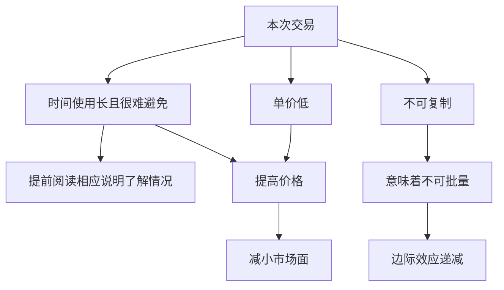

imagemagick二进制编译无法启用heic功能
<!--more-->

### 问题环境
|组件|版本|
|---|---|
|centos|7.9|
|imagemagick|7.1.1-13|
|libheif|1.3.2-2.el7|
### 过程
问题： 二进制编译无法启用heic功能 

在接到问题的时候，以为只是模块编译问题，在自己按照文档一路操作下来结果和他的一致（由此可见，不要把别人想得太弱智）。然后，开始怀疑版本问题，但是最烦的就是二进制安装lib基础库，对比网络上的安装文档，似乎版本都相差不多，应该不至于出问题。后来翻到官方文档的安装有备注操作系统为centso8，所以怀疑为所有系统库都过低，导致无法识别。

后来在安装centos8系统并进行imagemagick安装后，正常开启heic功能。至此，矛头直指版本问题。后来，我降低版本，将imagemagick 7.1.1-13降低到7.1.0.25后heic功能正常开启。

### 总结
1. 对于问题，不要把别人想得过于弱智，调查清楚情况，打有把握的仗。
2. 对于人，不要把人想得过于好，做生意，下单付款后再开始，不然多半是白忙活一场。
3. 定价是一个问题。过低白忙活，过高别人不会付款。

### 参考文档

- [imagemagick高级安装文档](https://imagemagick.org/script/advanced-linux-installation.php)
- [imagemagick源码编译](https://imagemagick.org/script/install-source.php#linux)
- [文档有说明](https://imagemagick.org/script/download.php)