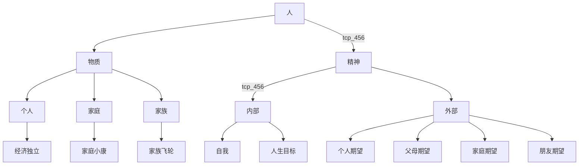

<!--more-->
## 对一个人的构成思考
定义： 目前普适定义为“人类”，人类这一物种的简化。  

纵向维度:
1. 一级成长曲线(作为主线)
2. 二级成长曲线(作为次级补充)
在当今社会中，人有以下属性：
1. 人生目标:
    - 5年愿景
    - 年目标
    - 月目标
    - 周任务
2. 物质条件：
    - 家庭
    - 财富
    - 
3. 关注内、外部的程度（以个体为分界，一体两面，过分关注自己会耗费大量注意力，于是减少了<!--  -->对外部的观察，反向同理）:
    - 内部:
        1. 关注“内部”，对自己更严格。
    - 外部:
        1. 关注"外部"，都是世界的问题。

## mbti

    外倾（E）-内倾（I）
    感知（S）-直觉（N）
    思考（T）-感情（F）

1. 如果MBTI测试结果最后一个字母是J（XXXJ），那么ta的判断功能T/F一定是外倾的。如果MBTI测试结果最后一个字母是P（XXXP）,那么ta的知觉功能N/S一定是外倾的。
2. 每个人都要将大脑里的一种功能运用于外部世界，将另一种运用到内部世界。
3. 偏好外倾（E）的人会把他们的优势功能用于外部世界，偏好内倾（I）的人会把他们的优势功能用于内部世界。即E型人用于外部世界的是ta的优势功能，I型人用于内部世界的是ta的优势功能。

第四功能与主导功能完全对立。

### infj  

主导功能 Ni
辅助功能 Fe
第三功能 Ti
第四功能 Se

对内探索内部世界，对外用感情权衡，对内用理性思考，对外用感知。  

进阶：
1. 过度迎合外界期待
2. 沉迷在自己的内在感知，自洽的系统里。

infj感知人
intj感知事态

完成外界期望和实现自我信念的平衡问题。  
回避社交、独立思考人生哲学、对社会现象感到愤怒、对社会产生悲观态度、陷入主观逻辑当中。凡事只接受自己认同的客观逻辑信息，感到人生虚无，不断通过一三功能循环，通过循环论证证明自己的合理性和价值感。  
正向名利情节于负向名利情节。自立和利他不完全对立。  
二三功能fe,Ti配合刺激Fi发展。而不是Ti与Fi冲突。明确自己的信念，明确个人与他人的界限，达成一定程度的平衡。   

边界：
1. 否定自己一直依赖花费时间探寻自我的经历。   每个人都有不一样的经历，未经他人苦，莫劝他人善。   对于可能无意包含否定含义的建议，需要冷静分解。关注建议带来的有利方面。  用共同解决问题这个目标包住否定含义。    
2. 对于直接教做事，不听自己逻辑的建议。   关注建议的有利方面，用共同解决问题这个目标包住否定含义。
3. 以什么为目标，让自己探索外界？或者说保持好奇？    
4. 对不道德的事情，如何应对？  
5. 避免内耗，一三功能循环。
infj问题：  
1. 脸皮薄。       需要一个逻辑。没讲好也没什么，下次注意修改就行。另外说错了，如果别人特别介意，那也没必要继续交流了，毕竟没办法一句话不说错。 
2. 过度退缩    不想用自己的挣扎来打扰别人。
3. 过于细致   压力下的infj变得更加僵化和完美主义。通过设定切合实际的目标和接受错误是成长的一部分来克服这一弱点。  
4. 回避日常生活   反思价值观和优先事项来管理这个弱点。在熟悉的生活中寻找新的体验来规避这种负面特质。练习感恩来减少这种人格弱点。
5. 完美主义       通过自我照顾克服弱点。设置健康边界规避这种负面特征。锻炼、冥想等。  
6. 与意想不到的变化作斗争  练习灵活性并尝试接受新的经验和方法。plan B规避负面特征。练习减压。
7. 冲突避免      练习自信，角色扮演。通过确定的价值观阐明对自己来说重要的事情避免这种负面特征。通过倾听并尝试理解，可以帮助在发生冲突时找到共同点。  
### infj 做销售面临的问题
不适合功利性质的销售工作。  
由于强fe，在和客户的相处过程中，会慢慢积累很多信任与好感，而这些好感会慢慢的转化为业绩。  
Ni功能善于抓住销售过程的本质，一个成熟的INFJ能在繁杂的信息中，抓住本质，找到关键点。  
觥筹交错、应酬会消耗能量，INFJ应对这种场合可能会有些局促和耗能。  

### 各人格类型有几大功能
一共有4大功能，分别是：
主导功能：中心岗位，性格的核心，提供驱动力
辅助功能：平衡主导功能
第三功能：很大程度上是无意识的，但可利用，基本中立
第四功能：很大程度上是无意识的，是我们的性格弱点

infp

### 荣格八维解释：
#### 外倾直觉型Ne
关键词：构思   
简单释义：主要负责的内容是发现并不直接相关的事物之间的联系，发散跳跃式思维。  
以Ne为主导功能的人格：ENTP发明家、ENFP追梦人  
以Ne为辅助功能的人格：INFP治愈者、INTP科学家  
#### 内倾直觉型Ni  
关键词：洞察  
简单释义：主要负责的内容是抽象思维和顿悟，以及事物的大局观。  
以Ni为主导功能的人格：INTJ战略家、INFJ引路人  
以Ni为辅助功能的人格：ENTJ领导者、ENFJ教育家  
#### 外倾感觉型Se
关键词：体验  
简单释义：主要负责的内容是对于外界细节变化的敏感觉察，以及对感官刺激的反应  
以Se为主导功能的人格：ESTP实践者、ESFP表演家  
以Se为辅助功能的人格：ISFP艺术家、ISTP手艺人  
#### 内倾感觉型Si
关键词：保存  
简单释义：主要负责的内容是对于过往细节的回忆，以及对于习惯、经验和传统的依赖。  
以Si为主导功能的人格：ISTJ检查者、ISFJ护卫者  
以Si为辅助功能的人格：ESTJ管理者、ESFJ东道主   
#### 外倾思维型Te  
关键词：结构化  
简单释义：主要负责的内容是让自己周围的事物按照效率优先的标准运转，尽可能优化外界资源，保持对外界活动的掌控力。  
以Te为主导功能的人格：ESTJ管理者、ENTJ领导者   
以Te为辅助功能的人格：ISTJ检查者、INTJ战略家   
#### 内倾思维型Ti
关键词：推理   
简单释义：主要负责的内容是分析事物内部的逻辑和运行规律，讲求结构化思考，对事物的运行原理和因果关系进行分析，同时对可能的结果进行预测。  
以Ti为主导功能的人格：ISTP手艺人、INTP科学家    
以Ti为辅助功能的人格：ESTP实践者、ENTP发明家    
#### 内倾情感型Fi    
关键词：连接   
简单释义：主要负责的内容是内心深处的情感冲动与价值观，是一个人深层次内核的重要体现。   
以Fi为主导的人格：INFP治愈者、ISFP艺术家    
以Fi为辅助的人格：ESFP表演家、ENFP追梦人
#### 外倾情感型Fe  
关键词：评估   
简单释义：主要负责的内容是对他人的感情冲动产生接收和共鸣，让身边的环境处于和谐快乐的状态，照顾大家的感受。   
以Fe为主导的人格：ESFJ东道主、ENFJ教育家   
以Fe为辅助的人格：ISFJ护卫者、INFJ引路人  

---

|mbti类型|主导功能|辅助功能|第三功能|劣势功能|第五功能|第六功能|第七功能|第八功能|
|---|---|---|---|---|---|---|---|---|---|
|entp发明家|Ne|Ti|Fe|Si|Ni|Te|Fi|Se|
|enfp追梦人|Ne|Fi|Fe|Si|Ni|Fe|Ti|Se| 
|intj战略家|Ni|Te|Fi|Se|Ne|Ti|Fe|Si|
|infj引路人|Ni|Fe|Ti|Se|Ne|Fi|Te|Si|  
|estp实践家|Se|Ti|Fe|Ni|Si|Ti|Fe|Ni|
|esfp表演家|Se|Fi|Te|Ni|Si|Fe|Ti|Ne|
|istj检查者|Si|Te|Fi|Ne|Se|Ti|Fe|Ni|
|isfj护卫者|Si|Fe|Ti|Ne|Se|Fi|Te|Ni|
|estj管理者|Te|Si|Ne|Fi|Ti|Se|Ni|Fe|
|entj领导者|Te|Ni|Se|Fi|Ti|Ne|Si|Fe|
|istp手艺人|Ti|Se|Ni|Fe|Te|Si|Ne|Fi|
|intp科学家|Ti|Ne|Si|Fe|Ni|Te|Fi|Se|
|infp治愈者|Fi|Ne|si|Te|Fe|Ni|Se|Ti|
|isfp艺术家|Fi|Se|Ni|Te|Fe|Si|Ne|Ti|
|esfj东道主|Fe|Si|Ne|Ti|Fi|Se|Ni|Te|
|enfj教育家|Fe|Ni|Se|Ti|Fi|Ne|Si|Te|

## 参考
[MBTI入门科普（四）阴面功能介绍](https://zhuanlan.zhihu.com/p/496114363)  
[一文看懂荣格八维是什么以及它与MBTI之间的关系](https://jzmbti.com/article/3548759442)   
[MBTI入门科普(二)MBTI与荣格八维](https://zhuanlan.zhihu.com/p/422530184)   

