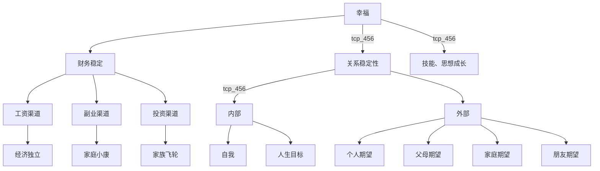

<!--more-->
目前面临的情况：
- 进需要突破工资上限
- 退需要调整工作性质及工作地域范围。
可能最后还是自媒体、销售性质的岗位吧，创业风险太高了。

## 目标
家庭和睦、幸福。  
子目标：
- 增强财务稳定性
- 拥有和睦的家庭关系

```mermaid
            graph TD

            A[幸福] -->B1[财务稳定]
            A -->|tcp_456| B2[关系稳定性]
            A -->|tcp_456| B3[技能、思想成长]
            B1 --> c11[工资渠道] --> d111[经济独立]
            B1 --> c12[副业渠道] --> d121[家庭小康]
            B1 --> c13[投资渠道] --> d131[家族飞轮]
            B2 -->|tcp_456| c21[内部]
            c21 --> d211[自我]
            c21 --> d212[人生目标]
            B2 --> c22[外部]
            c22 --> d221[个人期望]
            c22 --> d222[父母期望]
            c22 --> d223[家庭期望]
            c22 --> d224[朋友期望]

```

