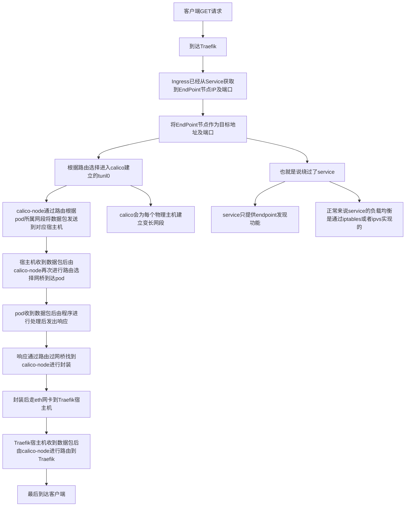

kubernetes 网络从client到服务端经过全过程
<!--more-->

kubernetes 网络流量的经历

```mermaid
flowchart TB
   客户端GET请求 --> 到达Traefik -->Ingress已经从Service获取到EndPoint节点IP及端口 --> 将EndPoint节点作为目标地址及端口 --> 根据路由选择进入calico建立的tunl0 --> calico-node通过路由根据pod所属网段将数据包发送到对应宿主机-->宿主机收到数据包后由calico-node再次进行路由选择网桥到达pod --> pod收到数据包后由程序进行处理后发出响应 --> 响应通过路由过网桥找到calico-node进行封装 --> 封装后走eth网卡到Traefik宿主机-->Traefik宿主机收到数据包后由calico-node进行路由到Traefik-->最后到达客户端
   根据路由选择进入calico建立的tunl0 --> calico会为每个物理主机建立变长网段
   将EndPoint节点作为目标地址及端口 --> 也就是说绕过了service --> service只提供endpoint发现功能
   也就是说绕过了service -->正常来说service的负载均衡是通过iptables或者ipvs实现的
```